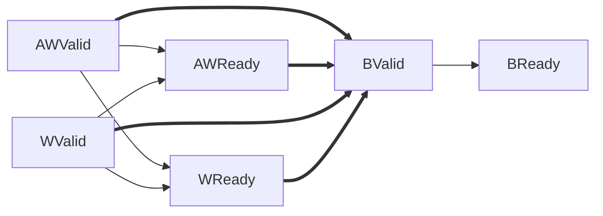
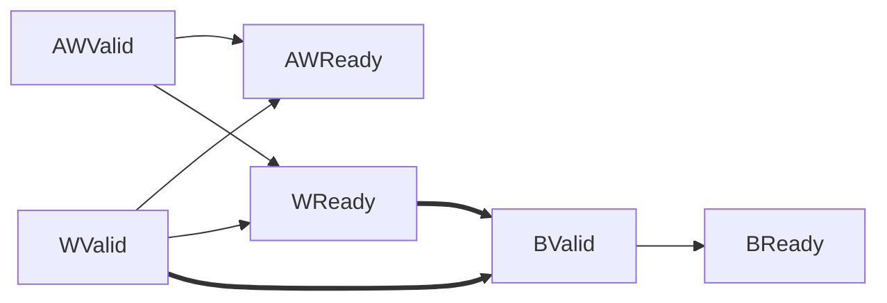
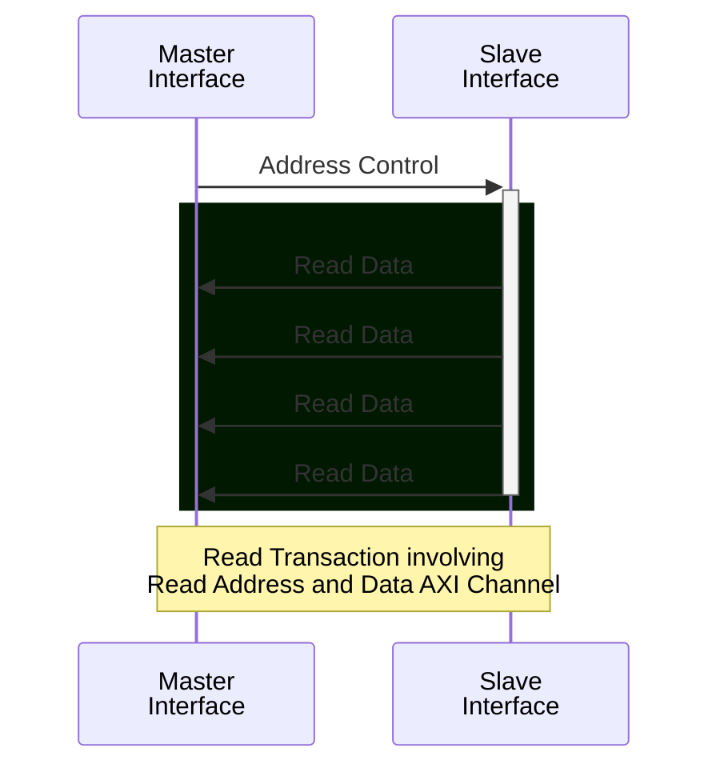
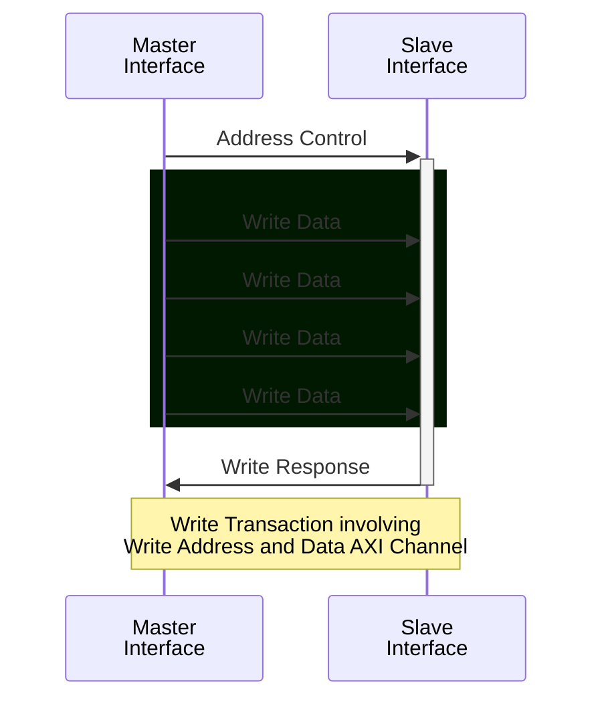
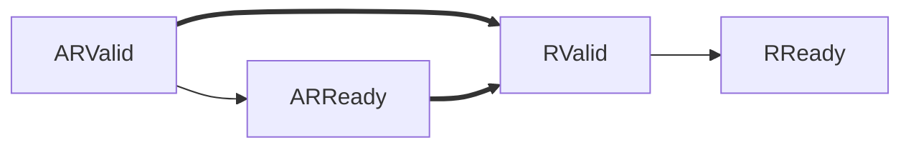

# Introduction

### Bus Boundary
$128*16*2=4kb$

```mermaid
graph LR
  A[AWValid] & D[WValid] --> B[AWReady] & E[WReady]
  A & B ==> C[BValid]
  D & E ==> C[BValid]
  C --> BReady
```

```mermaid
graph LR
  A[AWValid] & D[WValid] --> B[AWReady] & E[WReady]
  D & E ==> C[BValid]
  C --> BReady
```

```mermaid
sequenceDiagram
  Participant M as Master<br>Interface
  Participant S as Slave<br>Interface
    M->>+S: Address Control
    rect rgb(0, 25, 0)
    S->>M: Read Data
    S->>M: Read Data
    S->>M: Read Data
    S->>-M: Read Data
    end
    Note over M,S: Read Transaction involving <br>Read Address and Data AXI Channel
```

```mermaid
sequenceDiagram
  Participant M as Master<br>Interface
  Participant S as Slave<br>Interface
    M->>+S: Address Control
    rect rgb(0, 25, 0)
    M->>S: Write Data
    M->>S: Write Data
    M->>S: Write Data
    M->>S: Write Data
    end
    S->>-M: Write Response
    Note over M,S: Write Transaction involving <br>Write Address and Data AXI Channel
```
```mermaid
info
```

```mermaid
graph LR
  A[ARValid] --> B[ARReady]
  A & B ==> C[RValid]
  C --> RReady
```
